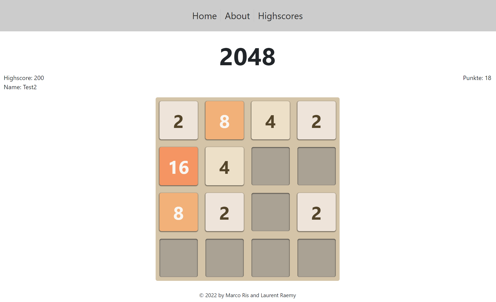

# 2048
Semesterarbeit im Modul Fortgeschrittene Webtechnologie.

Die Semesterarbeit wurde durch Marco Ris und Laurent Raemy als Gruppenarbeit an der FFHS Bern realisiert.


## Backend mit Docker starten
Um das Backend starten zu können, welchselt man in den Ordner:
````bash
cd fwebt_semesterarbeit_backend_laurent_raemy_marco_ris
````
und führt folgenden Docker-Befehl aus:
````bash
docker compose up -d
````

Falls Docker nicht installiert ist, kann der Nodejs Server mit folgendem Befehl gestartet werden:
````bash
node controller.js
````

## Frontend starten
Um das Frontend starten zu können, wechselt man in den Ordner:
````bash
fwebt_semesterarbeit_laurent_raemy_marco_ris
````
und führt folgenden Befehl aus:
````bash
npm start
````

Das Frontend wird automatisch geöffnet und man kann 2048 spielen.